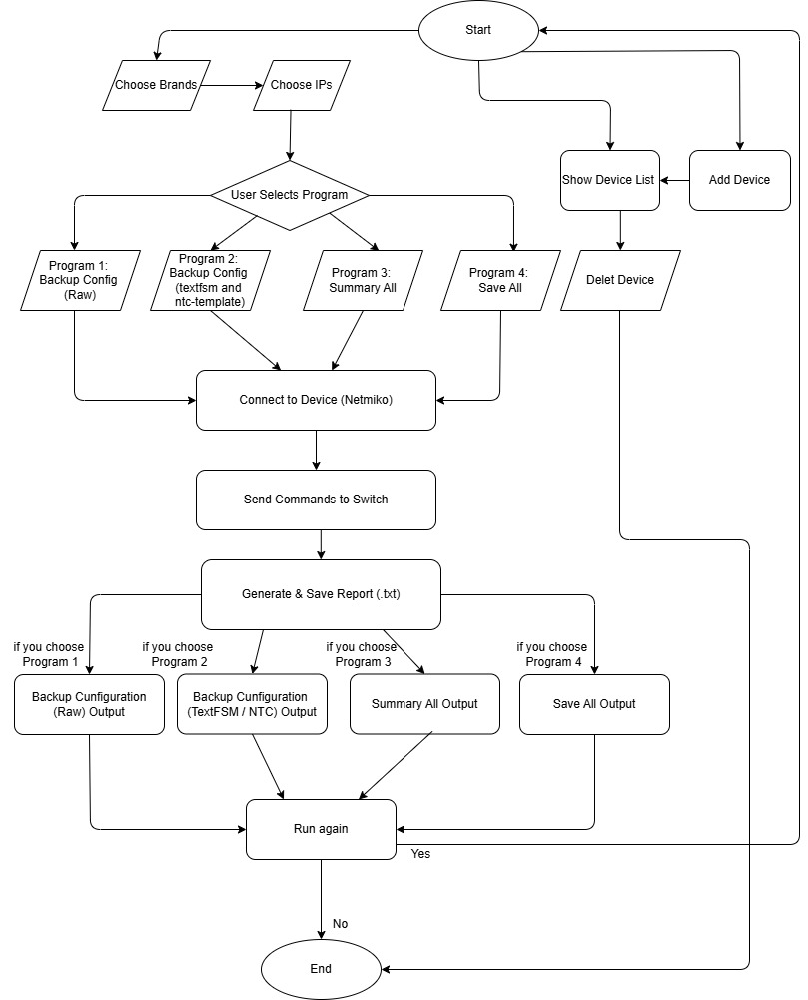
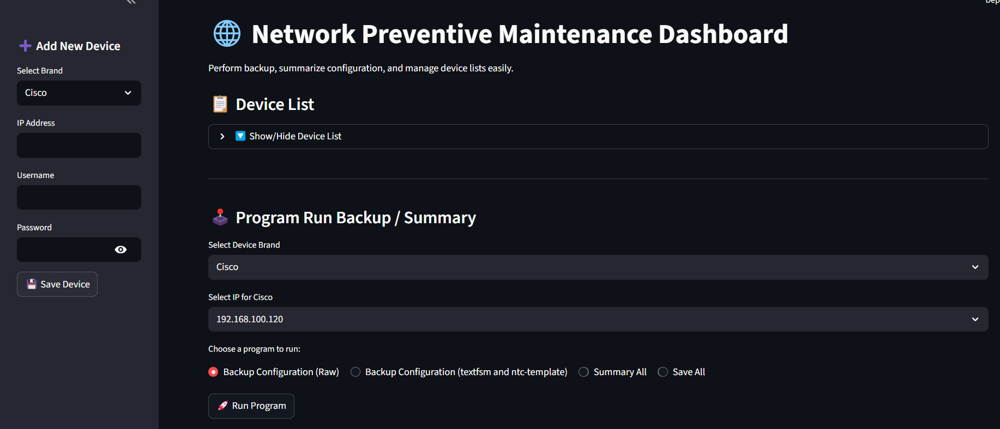
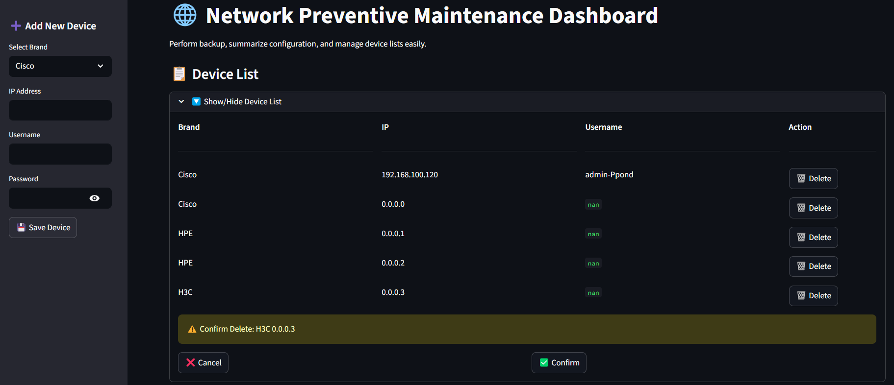
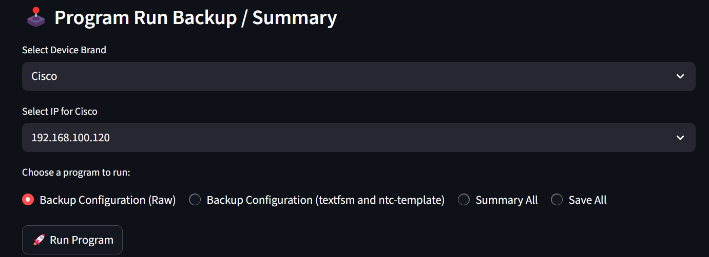
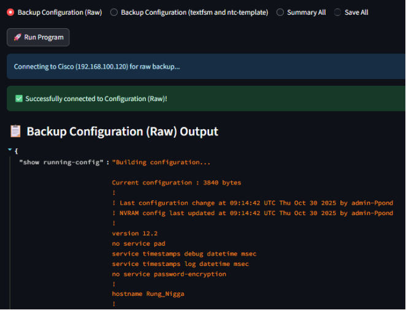
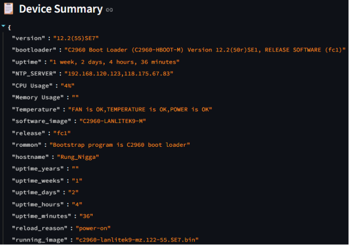
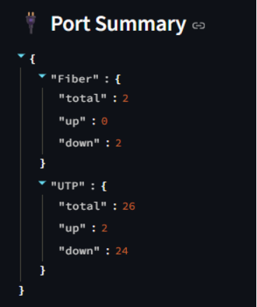

# Automatic Network Device Backup and Monitoring System (NetworkTool)

NetworkTool is a web-based dashboard designed to automate the Network Preventive Maintenance process. The system replaces traditional manual operations with automated network device backup, monitoring, and reporting, helping improve efficiency, reduce human errors, and organize configuration data in a structured manner.

---

## 🌟 Key Features

### Multi-Vendor Auto Backup

* Automatically connect to and back up network device configurations from multiple vendors.
* Currently supports:

  * Cisco
  * HPE
  * H3C

### Smart Configuration Parsing

* Convert raw configuration data obtained from commands such as `show running-config` into structured and human-readable formats.
* Supports JSON and key-value representations for easier analysis and documentation.

### Device & Port Summary

* Display essential device information, including:

  * Operating system version
  * Uptime
  * Hardware information
  * CPU and memory utilization
* Summarize port usage statistics:

  * Fiber ports (Up/Down)
  * UTP ports (Up/Down)

This feature simplifies the process of completing Network Equipment Check Sheets during preventive maintenance.

### Executable Version

* Package the application as a standalone executable file (`.exe`) using PyInstaller.
* End users can run the application without installing Python.

### Automated Report Generation

* Generate and save maintenance reports automatically in text format (`.txt`).
* Reports are named using the format:

```text
Brand_IP_Program.txt
```

* Includes timestamp information for traceability and auditing.

---

## 🏗️ System Architecture

The system consists of four main programs that users can execute based on their requirements:

### Program 1 – Backup Config Raw

Back up raw configuration data directly from network devices.

### Program 2 – Backup Config Parsed

Back up configurations and convert them into structured data using a custom parsing engine.

### Program 3 – Summary All

Collect and summarize key device information, including hardware status, temperature, reload history, and port utilization.

### Program 4 – Save All

Execute all programs and save all collected information in a single operation.



---

## 🛠️ Technology Stack

### Core Language & Framework

* Python 3.8+
* Streamlit

### Libraries & Utilities

* Netmiko

  * SSH connection management and command execution on network devices
* TextFSM & NTC Templates

  * Parse unstructured CLI outputs into structured data
  * Includes custom templates for vendor-specific commands
* Pandas

  * Data management and Excel integration
* PyInstaller

  * Generate standalone executable files

---

## 📂 Project Structure

```text
NetworkTool/
├── templates/             # Custom TextFSM templates
├── app.py                 # Streamlit UI and frontend logic
├── main.py                # Backend processing and SSH connections
├── run_app.py             # Application launcher
├── dataset.xlsx           # Device inventory database
├── requirements.txt       # Project dependencies
└── NetworkTool.spec       # PyInstaller configuration
```

## 🚀 Getting Started

### 1. Clone the Repository

```bash
git clone https://github.com/Gnuriass/NetworkTool.git
cd NetworkTool
```

### 2. Install Dependencies

```bash
pip install -r requirements.txt
```

### 3. Run the Application

```bash
streamlit run app.py
```

Open your browser and navigate to:

```text
http://localhost:8501
```

(or the port specified in the terminal output)

---

## 📸 Dashboard Screenshots

### 1. Main Dashboard & Device Management

The main dashboard displays all registered network devices and provides a sidebar interface for adding new devices to the inventory database.





### 2. Program Execution Interface

Users can select:

* Device vendor (Cisco, HPE, H3C)
* Device IP address
* Desired backup or monitoring program

and execute operations directly from the dashboard.



### 3. Configuration Backup Results

#### Raw Configuration Output

Displays raw configuration data retrieved directly from network devices.

#### Parsed Configuration Output

Displays structured JSON-like output generated through TextFSM parsing, making configurations easier to read and analyze.



### 4. Device & Port Summary

Provides a comprehensive overview of device health and network status, including:

* OS version
* System uptime
* CPU utilization
* Port statistics
* Fiber port status
* UTP port status






---

## 📚 Academic Context

This project was developed as part of the **CPE-492 Cooperative Education Program**.

The project was conducted during an internship placement and supported by professional Network Engineers at **Chun Bok Co., Ltd.**, focusing on practical preventive maintenance operations, network automation, and configuration management.


------------------------------------------------------------------------------
# Automatic Network Device Backup and Monitoring System (NetworkTool)

ระบบสำรองข้อมูลและตรวจสอบอุปกรณ์เครือข่ายอัตโนมัติ พัฒนาขึ้นในรูปแบบ Web Dashboard เพื่อเปลี่ยนกระบวนการทำ Network Preventive Maintenance จากเดิมที่เป็นแบบ Manual ให้เป็นระบบอัตโนมัติ ช่วยเพิ่มความรวดเร็ว ลดความผิดพลาด และจัดการข้อมูลการตั้งค่าอย่างเป็นระบบ

---

## 🌟 คุณสมบัติเด่นของระบบ (Key Features)
- **Multi-Vendor Auto-Backup:** เชื่อมต่อและสำรองข้อมูลการตั้งค่าอุปกรณ์เครือข่ายได้หลากหลายยี่ห้อ (รองรับ Cisco, HPE, H3C) พร้อมกันแบบอัตโนมัติ
- **Smart Configuration Parsing:** แปลงข้อมูลข้อความดิบ (Raw Data) จากการใช้คำสั่ง `show running-config` ให้ออกมาเป็นโครงสร้างข้อมูลที่อ่านง่าย (เช่น JSON/Key-Value)
- **Device & Port Summary:** หน้าจอสรุปข้อมูลสถานะของอุปกรณ์ (Version, Uptime, Hardware, CPU/Memory Usage) และสถานะพอร์ตเชื่อมต่อ (นับจำนวนพอร์ต Fiber และ UTP ที่ใช้งานอยู่และปิดอยู่) เพื่อความสะดวกในการกรอก Network Equipment Check Sheet
- **Executable Version:** สามารถคอมไพล์ระบบเป็นไฟล์ Executable (.exe) เพื่อเปิดใช้งานได้ทันทีโดยที่เครื่องปลายทางไม่จำเป็นต้องติดตั้ง Python
- **Report Generation:** จัดเก็บรายงานสรุปผลอัตโนมัติออกมาในรูปแบบไฟล์ Text (.txt) โดยตั้งชื่อแยกตามสถาปัตยกรรม `Brand_IP_Program.txt` พร้อมระบบประทับเวลา (Timestamp)

---

## 🏗️ สถาปัตยกรรมและการทำงานของระบบ (System Architecture)
ระบบทำงานผ่าน 4 โปรแกรมหลักที่ผู้ใช้งานสามารถเลือกสั่งการได้ตามความต้องการ:
1. **Program 1 (Backup Config Raw):** สำรองข้อมูลคอนฟิกดิบจากตัวอุปกรณ์โดยตรง
2. **Program 2 (Backup Config Parsed):** สำรองข้อมูลคอนฟิกพร้อมแปลงค่าให้อยู่ในโครงสร้าง Structured Data ด้วย Engine พิเศษ
3. **Program 3 (Summary All):** ดึงข้อมูลสรุปภาพรวมของฮาร์ดแวร์ อุณหภูมิ ประวัติการรีโหลด และปริมาณพอร์ตที่ใช้งาน
4. **Program 4 (Save All):** สั่งรันและบันทึกข้อมูลทุกหมวดหมู่พร้อมกันในครั้งเดียว
   

---

## 🛠️ เครื่องมือที่ใช้พัฒนาเทคโนโลยี (Tech Stack)

### Core Language & UI Framework
- **Python 3.8+** (ภาษาหลักในการพัฒนา Logic)
- **Streamlit** (Web UI Framework สำหรับสร้าง Dashboard หน้าบ้าน)

### Libraries & Core Utilities
- **Netmiko:** จัดการการเชื่อมต่อระยะไกลและส่งชุดคำสั่งไปยัง Switch/Router ผ่านโปรโตคอล SSH
- **TextFSM & NTC Templates:** มอเตอร์หลักในการแปลง Text Output ที่ไม่มีโครงสร้างให้กลายเป็น Structured Data และมีการปรับแต่ง Custom Template เพิ่มเติมเพื่อรองรับคำสั่งที่ซับซ้อน
- **Pandas:** ใช้สำหรับเขียน-อ่าน และจัดการตารางข้อมูลอุปกรณ์
- **PyInstaller:** ใช้ห่อหุ้มซอร์สโค้ดเพื่อสร้างโปรแกรมพร้อมใช้งานแบบ Executable (.exe)

---

## 📂 โครงสร้างของโปรเจค (Project Structure)
    ```text
    NetworkTool/
    ├── templates/             # โฟลเดอร์เก็บไฟล์ Custom TextFSM Template สำหรับ Parse ข้อมูล
    ├── app.py                 # ตัวจัดการหน้าเว็บหน้าบ้าน (Web Interface & UI Logic)
    ├── main.py                # ระบบประมวลผลหลังบ้าน (Backend Logic & SSH Connection)
    ├── run_app.py             # Script สำหรับการสั่งรันโปรแกรมหลัก
    ├── dataset.xlsx           # ฐานข้อมูลภายในสำหรับเก็บค่า Brand, IP, Username, Password ของอุปกรณ์
    ├── requirements.txt       # รายการ Library และ Dependency ที่ระบบต้องการ
    └── NetworkTool.spec       # ไฟล์ตั้งค่าสำหรับใช้ทำคอมไพล์ด้วย PyInstaller

## 🚀 ขั้นตอนการติดตั้งและรันใช้งาน (Getting Started)
1. โคลนและเตรียมตัวโปรเจค
   - git clone [https://github.com/Gnuriass/NetworkTool.git](https://github.com/Gnuriass/NetworkTool.git)
cd NetworkTool
2. ติดตั้ง Library ที่จำเป็น
   - pip install -r requirements.txt
3. สั่งรันระบบ
   - streamlit run app.py
จากนั้นเข้าใช้งานผ่านเว็บเบราว์เซอร์ที่ URL: http://localhost:8501 (หรือพอร์ตที่ระบุบน Terminal)

## 📸 ตัวอย่างผลลัพธ์หน้าจอใช้งาน (Dashboard Screenshots)

เพื่อให้เห็นภาพการทำงานของระบบ นี่คือตัวอย่างหน้าจอหลักของ **NetworkTool** ผ่าน Streamlit Web UI:

### 1. หน้าแรกของ Dashboard และการจัดการอุปกรณ์ (Main Dashboard & Device Management)
[cite_start]หน้าจอหลักสำหรับการเรียกดูรายการอุปกรณ์เครือข่ายทั้งหมดในระบบ (Device List) พร้อมแถบด้านข้าง (Sidebar) สำหรับการเพิ่มอุปกรณ์ใหม่เข้าสู่ฐานข้อมูลตาราง Excel [cite: 159, 169, 178, 230]


### 2. หน้าจอการเลือกโปรแกรมและรันคำสั่ง (Program Execution Window)
[cite_start]ผู้ใช้สามารถเลือกแบรนด์อุปกรณ์ (เช่น Cisco, HPE, H3C) เลือกหมายเลข IP และเลือกโปรแกรมคำนวณ/สำรองข้อมูลที่ต้องการรันได้อย่างง่ายดาย [cite: 124, 181, 182, 185, 187, 188]


### 3. ผลลัพธ์การสำรองข้อมูล (Backup Output Examples)
* [cite_start]**แบบ Raw Configuration:** แสดงข้อมูลผลลัพธ์ข้อความดิบที่ดึงมาจากคำสั่ง `show running-config` [cite: 262, 263]
* [cite_start]**แบบ Parsed Configuration:** แสดงข้อมูลที่ผ่านการแปลงด้วย TextFSM ออกมาเป็นรูปแบบ Structured JSON ทำให้อ่านง่ายและเป็นระบบ [cite: 157, 274, 275]


### 4. หน้าจอสรุปสถานะอุปกรณ์และพอร์ต (Device & Port Summary)
[cite_start]ระบบจะทำการแจกแจงข้อมูลสำคัญ เช่น เวอร์ชันระบบปฏิบัติการ, ระยะเวลาที่ระบบเปิดใช้งาน (Uptime), ปริมาณการใช้งาน CPU รวมถึงการแยกนับจำนวนพอร์ต Fiber และ UTP ออกมาเป็นสถานะ Up/Down อย่างชัดเจน [cite: 293, 295, 297, 319, 320, 321]


---

## 👥 Project Author

**Sarochinee Bunyarit**

* 4th-Year Undergraduate Student
* Computer Engineering and Artificial Intelligence Program (CE)
* Thai-Nichi Institute of Technology (TNI)

* โครงงานนี้เป็นส่วนหนึ่งของวิชา CPE-492 Co-operative Education (สหกิจศึกษา) โดยได้รับการสนับสนุนด้านเทคนิคและการฝึกฝนการทำ Preventive Maintenance ภายใต้การดูแลของทีม Network Engineer บริษัท ชุน บ็อก จำกัด
* This project is part of the CPE-492 Co-operative Education course, with technical support and training in Preventive Maintenance under the supervision of the Network Engineer team at Chunbok Co., Ltd.
